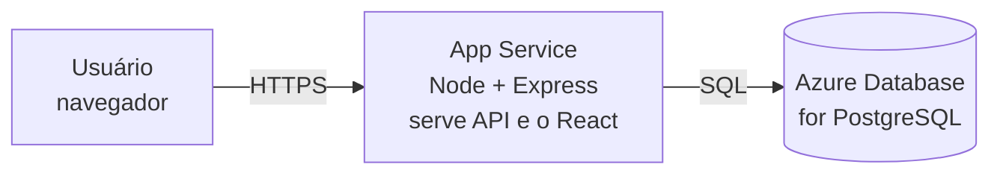
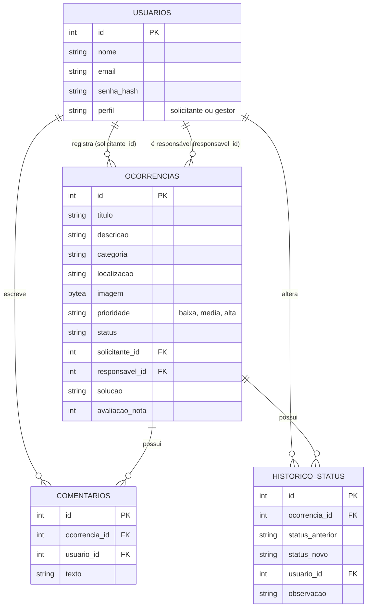
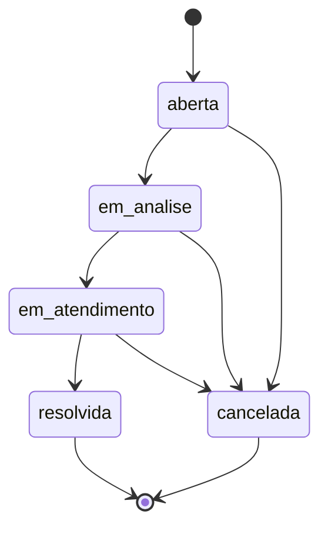

# Arquitetura — Resolve Aí

Esse documento mostra, de forma simples, como as peças do sistema se conectam.

## Visão geral

Uma aplicação Full Stack clássica: um frontend em React que conversa com uma
API em Node/Express, que por sua vez lê e escreve num banco Postgres. Tudo
roda dentro de um único container (o Express também serve os arquivos
estáticos do React em produção).

## Modelo de dados (ER simplificado)

## Ciclo de vida da ocorrência

Toda ocorrência nasce **aberta** e segue esse fluxo. Cada seta representa uma
troca de status, e cada troca gera uma linha na tabela `historico_status`
(status anterior, novo status, data/hora, usuário responsável e observação).

## Perfis de usuário

- **Solicitante**: cria conta, registra ocorrências, acompanha o andamento,
  comenta, consulta o histórico e avalia a resolução.
- **Gestor**: vê todas as ocorrências, filtra por categoria/status/prioridade,
  muda a prioridade, atribui um responsável, muda o status, comenta, registra
  a solução aplicada e acompanha o dashboard com indicadores.
